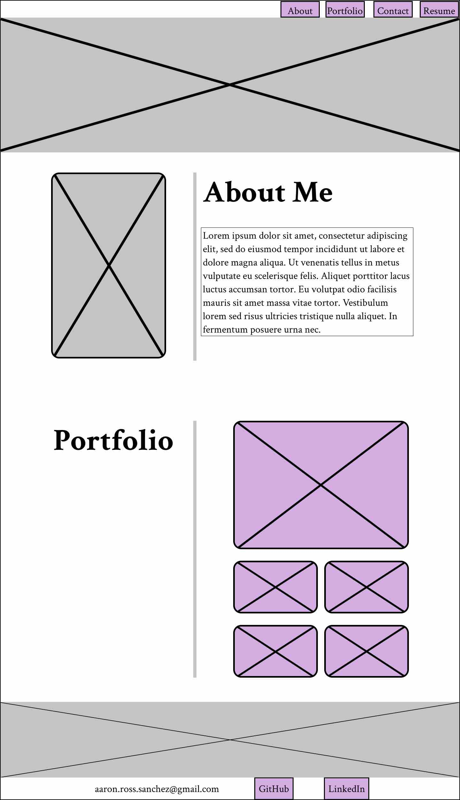
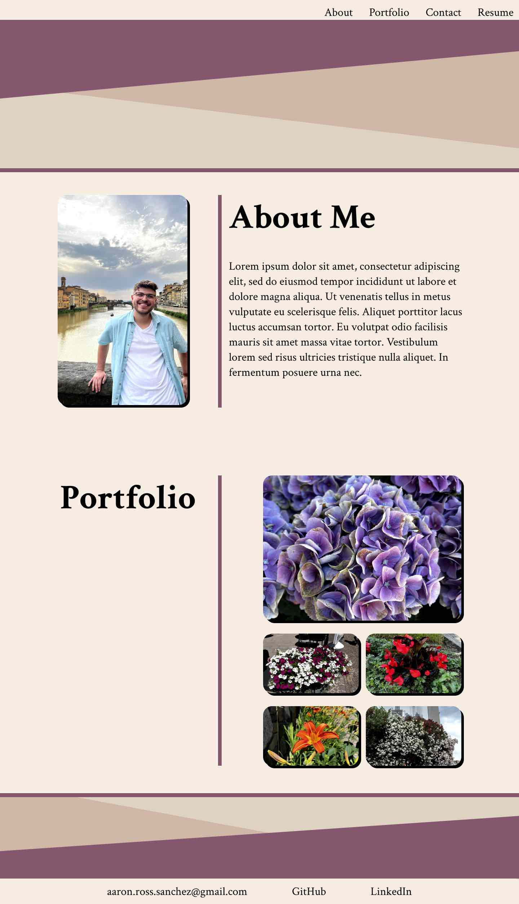

# professional-portfolio

## Description
In this repository, there are a total of 7 html and 4 css files that make up this professional portfolio. Starting completely from scratch, this project was built first with a wireframe and high fidelity model of the pages to be created. The wireframe and high fidelity index pages can be found below. Once the site was design, the HTML was created, followed by the CSS. Whenever a new, advanced concept was learned through the xpert learning assistant, w3schools, and MDN are defined with CSS comments explaining what that code does. The color pallete, wireframes, and high fidelity models can be found in the repo as well. 

## Usage

<strong>Wireframe</strong>
 
index.html 
 

<strong>High Fidelity</strong>
 
index.html
 

<strong>Screenshots of Application</strong>
 
index.html
 

project.html
 

placeholder.html
 

You can access the deployed application <a href="https://aaron-ross-sanchez.github.io/professional-portfolio/">here</a>.

## Credits

Wireframe and High Fidelity models made by myself with Figma

Color Pallete obtained from https://colorhunt.co/palettes/random

## License

Please refer to the LICENSE in the repo.

